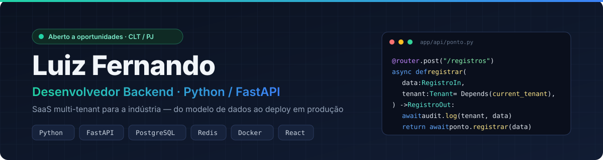

  

  
  
  

## Em resumo

Desenvolvedor backend que **entrega sistemas completos para clientes reais**: arquitetura, API, banco de dados,
segurança, testes, containers e deploy. Especializado em **SaaS multi-tenant** para o setor industrial,
onde o software precisa cumprir a lei trabalhista e funcionar no canteiro de obra.

- 🏗️ **Sistemas em produção** para a GRAMO Engenharia: ponto eletrônico e gestão de materiais
- ⚖️ **Conformidade legal como código**: Portaria MTP 671/2021 (REP-P), eSocial, LGPD
- 🔐 **Segurança desde o primeiro commit**: 2FA, RBAC, isolamento de dados por empresa, auditoria
- 🚀 **Ponta a ponta**: modelagem, migrações, testes automatizados, Docker e deploy
- 🎓 Engenharia de Software · UniCesumar

## Stack

  

`SQLAlchemy 2 async` `Alembic` `Pytest` `Celery` `WebSockets` `JWT` `RBAC` `MFA/TOTP` `Row Level Security` `Multi-tenancy` `REST APIs`

## Projetos

<table>
<tr>
<td width="50%" valign="top">

### ⏱️ .GRAMO — Ponto Eletrônico REP-P
Controle de jornada para equipes de campo em várias obras, em conformidade com a **Portaria 671/2021**.

- Ponto com **reconhecimento facial + GPS**, funciona **offline**
- Isolamento entre empresas com **Row Level Security** no PostgreSQL
- Registros imutáveis, assinatura **Ed25519**, arquivos legais **AFD / AEJ**
- Operador da plataforma **sem acesso** aos dados dos clientes
- **NestJS · Prisma · PostgreSQL · React PWA** · registro no INPI em andamento

[Repositório →](https://github.com/luizfernandoantonio345-webs/gramo-ponto)

</td>
<td width="50%" valign="top">

### 📦 GWI — Gestão de Materiais
Almoxarifado de obra da GRAMO Engenharia: requisição, aprovação por alçada, compra, baixa por QR Code e comodato.

- **Kardex à prova de adulteração** com hash SHA-256 encadeado
- Reserva de saldo + locking otimista: **sem condição de corrida** no estoque
- JWT com rotação e detecção de reuso, **MFA**, RBAC por alçada
- **45 endpoints · 62 testes** (incluindo testes de ataque)
- **FastAPI · SQLAlchemy async · PostgreSQL · React PWA**

[Demo →](https://gwi-frontend.vercel.app) · [API →](https://github.com/luizfernandoantonio345-webs/gwi-materiais-backend) · [Frontend →](https://github.com/luizfernandoantonio345-webs/gwi-frontend)

</td>
</tr>
<tr>
<td width="50%" valign="top">

### 🧾 Comanda Digital — Açaiteria
Cliente escaneia o QR da mesa, monta o açaí no celular e o pedido aparece na hora no balcão.

- Balcão atualizado em **tempo real** (Supabase Realtime) com aviso sonoro
- Acesso controlado no banco com **Row Level Security**
- Painel da dona: preços, esgotados e impressão dos QR
- **Next.js · TypeScript · Supabase (Postgres) · Tailwind**

[Demo →](https://a-a-da-patr-cia.vercel.app) · [Repositório →](https://github.com/luizfernandoantonio345-webs/acai-da-patricia)

</td>
<td width="50%" valign="top">

### 👷 WorkFlow RH em desenvolvimento
SaaS B2B de RH para terceirizadas do setor industrial.

- eSocial, NR-1 (riscos psicossociais) e LGPD
- Argon2id, refresh token rotativo, dados pessoais criptografados
- Isolamento de empresas na camada de ORM
- **FastAPI · PostgreSQL · Redis · Celery · React Native**

</td>
</tr>
</table>

<b>Outros projetos</b>

 

- **JARVIS** — assistente de IA local com múltiplos agentes (planejador, executor, crítico, memória), LLM via Ollama e módulo de segurança com análise estática e mapeamento MITRE ATT&CK
- **[Automação CAD](https://github.com/luizfernandoantonio345-webs/Automacao-CAD)** — automação de projetos de tubulação industrial em Python
- **[Unir Soldas](https://unir-soldas.vercel.app)** — site institucional para empresa de soldagem

## Estudando agora

Segurança de aplicações (PortSwigger Web Security Academy) · Algoritmos e estruturas de dados · Inglês técnico

---

<b>Procurando um dev backend Python que entende a operação do cliente?</b> 
Fale comigo pelo <a href="https://instagram.com/luuiz.dev">Instagram</a>.

